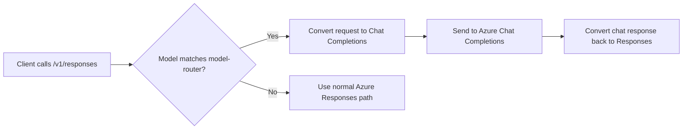

## Overview

Azure model router is an Azure OpenAI deployment family that Bifrost treats as an Azure-specific routing target. It is useful when you want to keep using the Azure provider surface, but the target deployment does not expose `/v1/responses` natively.

Bifrost detects model names that match the Azure model-router family and automatically routes Responses requests through Chat Completions instead. The caller still uses the Responses API, but Azure receives a chat-completions request under the hood.

<Note>
This page covers the model-router routing behavior only. For endpoint setup, authentication, aliases, and deployment configuration, see the main [Azure provider guide](./azure).
</Note>

### Supported operations

| Operation | Support | Notes |
| --- | --- | --- |
| Chat Completions | ✅ | Routed directly to Azure Chat Completions |
| Chat Completions (stream) | ✅ | Routed directly to Azure Chat Completions |
| Responses API | ✅ | Bifrost falls back to Chat Completions automatically |
| Responses API (stream) | ✅ | Bifrost falls back to Chat Completions automatically |

<Note>
Azure model-router deployments do **not** support `/v1/responses` natively. The fallback is handled by Bifrost, so tool calling, streaming, and response shaping continue to work from the caller's perspective.
</Note>

---

## How it works

When the model name matches the Azure model-router family, Bifrost switches the request from Responses to Chat Completions before sending it to Azure.



That means you can continue using the Responses API at the Bifrost edge even though the Azure deployment itself only exposes chat completions.

---

## Usage

### Responses API

Use the normal Responses endpoint with a model-router model name:

```bash
curl -X POST http://localhost:8080/v1/responses \
  -H "Content-Type: application/json" \
  -d '{
    "model": "azure/model-router",
    "input": "Write a short haiku about gateways."
  }'
```

### Chat Completions

You can also call Chat Completions directly with the same model name:

```bash
curl -X POST http://localhost:8080/v1/chat/completions \
  -H "Content-Type: application/json" \
  -d '{
    "model": "azure/model-router",
    "messages": [
      {"role": "user", "content": "Write a short haiku about gateways."}
    ]
  }'
```

### Go SDK

```go
resp, err := client.ResponsesRequest(
    schemas.NewBifrostContext(ctx, schemas.NoDeadline),
    &schemas.BifrostResponsesRequest{
        Provider: schemas.Azure,
        Model:    "model-router",
        Input: []schemas.ResponsesMessage{{
            Role:    schemas.Ptr(schemas.ResponsesInputMessageRoleUser),
            Content: &schemas.ResponsesMessageContent{ContentStr: schemas.Ptr("Write a short haiku about gateways.")},
        }},
    },
)
```

<Note>
If you need to inspect provider-specific extra parameters, enable [Send Back Raw Response](/providers/request-options#send-back-raw-response). If you do not want those raw bytes persisted in logs, also set [Store Raw Request/Response](/providers/request-options#store-raw-request/response).
</Note>

---

## Limitations

- The fallback is specific to model-router deployments.
- Standard Azure OpenAI deployments still use the normal Azure Responses path.
- This page does not change Azure authentication or endpoint setup.

## Related docs

- [Azure](./azure)
- [Request Options](/providers/request-options)
